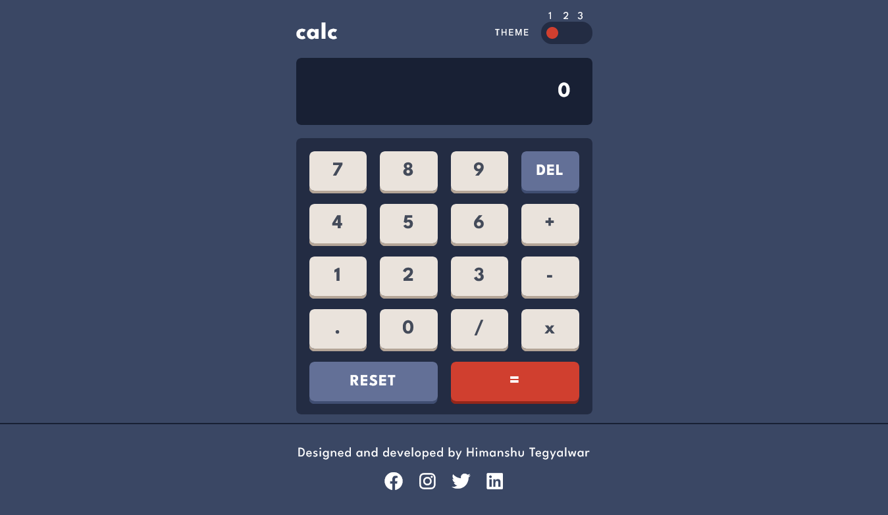
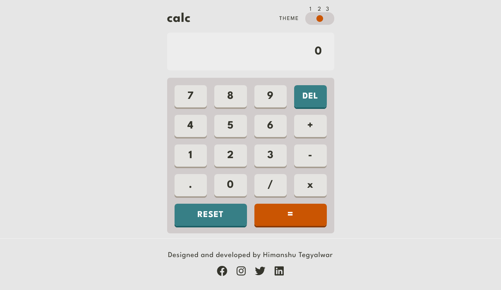
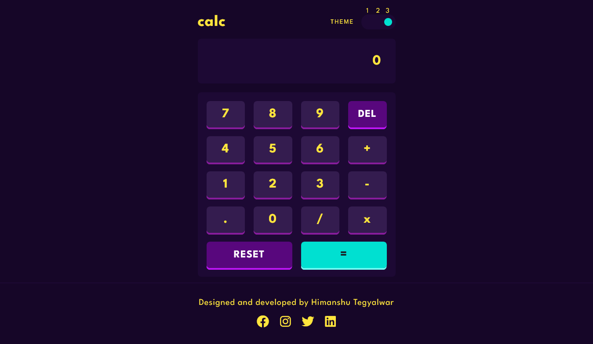

# Calculator

This is a solution to the [Calculator app challenge on Frontend Mentor](https://www.frontendmentor.io/challenges/calculator-app-9lteq5N29).

## Table of contents

- [The challenge](#the-challenge)
- [Built with](#built-with)
- [Screenshots](#screenshots)

## The challenge

Users should be able to:

- See the size of the elements adjust based on their device's screen size
- Perform mathmatical operations like addition, subtraction, multiplication, and division
- Adjust the color theme based on their preference

## Built with

- HTML, CSS, JS
- React JS, JSX
- Mobile-First

## Screenshots

### Dark Theme

### Light Theme

### Neon Theme
